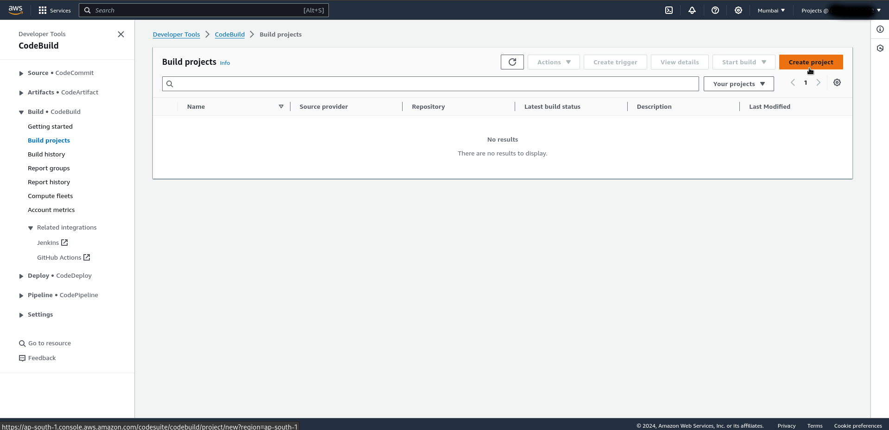

# AWS Continuous Integration Demo

## Set Up GitHub Repository

The first step in our CI journey is to set up a GitHub repository to store our Python application's source code. 

If you already have a repository, feel free to skip this step. Otherwise, let's create a new repository on GitHub by following these steps:

- Go to github.com and sign in to your account.
- Click on the "+" button in the top-right corner and select "New repository."
- Give your repository a name and an optional description.
- Choose the appropriate visibility option based on your needs.
- Initialize the repository with a README file.
- Click on the "Create repository" button to create your new GitHub repository.

Great! Now that we have our repository set up.

Next Step is to push you Python application in the github repository. (You can search online, how to push your code to a github repository.)

Now we are all set with our github, we can move on to the next step.

## (Optional) Create an AWS IAM user for the practice of this project.

You can follow these articles:  
- [Creating-Iam-User-Medium](https://medium.com/@Yasholo/creating-an-iam-user-in-aws-207ce765d579)
Tho its not mandatory to create a seprate IAM user to use aws, you can use the root user aswell. 
- [Creating-Iam-User-LinkedIn](https://www.linkedin.com/pulse/creating-iam-user-aws-yash-kumar-qrwhc/?trackingId=5jqj1hMdTkyPzoPjgfvWLQ%3D%3D)

<!-- But it is a good practice to not use the root user as you might end up messing some important or basic AWS settings.

Also you can controll all the permission for the IAM user account from the root account easily.

Steps:
- Login to your AWS root account.
- Go to Identity and Access Management (IAM).
- IAM Dashboard will open up 

- Click on User >> Create User 
- Enter your desired user name, check the access to AWS managent console option, choose a console password (either auto generated or custom), then click next.

- In set permission, select 'Attach Policies directly' (or other options if you know about them ) >> Select 'AdministratorAccess' (You can select specific policy aswell for better security and control, but for now we will go with admin access) and then click on next.

- Review your settings and then click on create user

- User created! Now download the .csv file it will contain ur security credentials.
 -->

- Now lets login to this IAM user and get started!

## Configure AWS CodeBuild

In this step, we'll configure AWS CodeBuild to build our Python application based on the specifications we define. CodeBuild will take care of building and packaging our application for deployment. Follow these steps:

- In the AWS Management Console, navigate to the AWS CodeBuild service.
- Click on the "Create build project" button.

- Provide a name for your build project.

- For the source provider, choose "Github".

- Now we need to connect our aws account to github.

- After connecting to github u can see all your personal repositories. Select the repository that contains you python application.

- Select the pipeline you created in the previous step.
- Configure the build environment, such as the operating system, runtime, and compute resources required for your Python application.

- In additional configuration of environment enable the flag for elevated docker build image privilages. Let rest configurations as it is.

- We need to write build commands but for that we would need some sensitive information like usernames and passwords. So to use them without exposing it to others we are going to use "AWS Systems Manager".
- Go to Systems Manager (you can search for it in the search bar) 
- In the system manager on the left hand side index search for "parameter store" and click on it.

- Click on "Create Parameter" 
- Now we need to create parameters. These paramteres are docker credentials. We need 3 parameters for this project, Docker username, docker password, docker registry url. Follow a convetional naming system so that it is easy to recall what the parameter is for. Also select type are SecureString.

- Remember to add the AWS Systems Manager service role in your codebuild service role group, without this step the codebuild won't be able to communicate with systems manager.

- Now Specify the build commands, such as installing dependencies and running tests. Customize this based on your application's requirements. (refer the image below for help)

- For this project as we are pushing on Dockerhub we don't need it but, You can set up the artifacts configuration to generate the build output required for deployment.

- Review the build project settings and click on the "Create build project" button to create your AWS CodeBuild project.

- Yay! You did it! With AWS CodeBuild all set up, we're now ready to witness the magic of continuous integration in action.

- Let me show you that our Project actually worked... Remember we have specified in our buildspec file to push our application on docker hub. Let's go to docker hub and check out if it worked. 

- So, Now you know how to make your own AWS Codebuild project Kudos to you!  Now go use this tool to make exciting CI projects!

## COnfigure AWS CodeDeploy

In this step, we'll configure AWS CodeDeploy.
- In the AWS Management Console, navigate to the AWS CodeDeploy service. Then Click on Create Application.

- Give the name of the application and select compute platform. 

- Now to deploy this app we need an ec2 instance. So lets create one! Go to EC2 instances, Launch instance, select the required settings like name, image, instance type (use t2.micro for free tier), Key pair, network settings (make sure public ip is enabled, and u can use the default vpc), and then create on Launch instance.

- We need to create a tag for this instance which will be used by aws codedeploy (because there can be multiple instances and tags help in identifying a instance with particular key-value pair easily.)

- Now we need to install an agent in this EC2 instance. 
    - Login to EC2
    - you can follow the following documentation: [Installing CodeDeploy agent for ubuntu server](https://docs.aws.amazon.com/codedeploy/latest/userguide/codedeploy-agent-operations-install-ubuntu.html)
    
    - Here is a history of commands I used.
    

- Now its time to give our EC2 instance some permissions so that it can communicate to aws CodeDeploy and vice-versa. To do that we will create an IAM role and grant our ec2 instace with this role.

- Go to IAM >> Roles >> Create role >> select "EC2" in use case >> click next >> select 'AmazonEC2FullAccess' >>  next >> Give Role name >> click create role. (Similarly create one more role for use case: "CodeDeploy")

- Your role has been created now lets assign it to our ec2 instance. 
    Click on Instance >> Actions >> Security >> Modify IAM Role >> Choose you IAM role from dropdown  list >> click "Update IAM Role"

- Once you have updated IAM Role, go to ur instance terminal and restart the service. {sudo systemctl restart codedeploy-agent}

- Now in CodeDeploy we need to create deployment group to establish connect with ec2. 
    Click on "Create Deployment Group" >> enter name for the group >> select service role (with usecase as codedeploy)>> Deployment type: In-place >> Environment config: Amazon EC2 Instance >> select key-value pair >> disable loadbalancer for now >> click on "create deployment group" 

- Now, a final task! We need to create deployment. Go to your CodeDeploy application, and in the "Deployments" section click on "Create deployment" button.

- Select the deployment group that we just created.
- In revision type, select Github (If your github account is created you would see you github name alias, If not connected, write you github username in the input field and then click on "connect to github" and follow the steps, your account will connect!)
- Now select the repository which contains you python flask app and other required files (use the same repo as used for CodeBuild.) give its latest commit ID.

- Other settings you can modify if you want to and then click on "Create deployment" button.

- If you see that the deployment fails on the first step. (This fail is due to the ec2 instance not running and thus code deploy agent not running on the instance.)

To solve this fail, make sure your instance in running and in the instance the code deploy agent is up!

- Now click on 'Retry deployment' button.
- This time the deployment will fail on the 'Beforeinstall" step. 

The reason for this is that we need one "appspec.yaml" file, which if you look at the github repository is available but it is not at the root of the repository. (i.e yasholo/AWS-Devops) [I have used a repository which has multiple repositories and our sample app has many parent repositories. You can avoid it by initialising a new github repository which contains only the required files and has appspec.yml at the root]

- Let's fix this issue.

## Create an AWS CodePipeline
In this step, we'll create an AWS CodePipeline to automate the continuous integration process for our Python application. AWS CodePipeline will orchestrate the flow of changes from our GitHub repository to the deployment of our application. Let's go ahead and set it up:

- Go to the AWS Management Console and navigate to the AWS CodePipeline service.
- Click on the "Create pipeline" button.
- Provide a name for your pipeline and click on the "Next" button.
- For the source stage, select "GitHub" as the source provider.
- Connect your GitHub account to AWS CodePipeline and select your repository.
- Choose the branch you want to use for your pipeline.
- In the build stage, select "AWS CodeBuild" as the build provider.
- Create a new CodeBuild project by clicking on the "Create project" button.
- Configure the CodeBuild project with the necessary settings for your Python application, such as the build environment,  build commands, and artifacts.
- Save the CodeBuild project and go back to CodePipeline.
- Continue configuring the pipeline stages, such as deploying your application using AWS Elastic Beanstalk or any other suitable deployment option.
- Review the pipeline configuration and click on the "Create pipeline" button to create your AWS CodePipeline.

Awesome job! We now have our pipeline ready to roll. Let's move on to the next step to set up AWS CodeBuild.

## Trigger the CI Process

In this final step, we'll trigger the CI process by making a change to our GitHub repository. Let's see how it works:

- Go to your GitHub repository and make a change to your Python application's source code. It could be a bug fix, a new feature, or any other change you want to introduce.
- Commit and push your changes to the branch configured in your AWS CodePipeline.
- Head over to the AWS CodePipeline console and navigate to your pipeline.
- You should see the pipeline automatically kick off as soon as it detects the changes in your repository.
- Sit back and relax while AWS CodePipeline takes care of the rest. It will fetch the latest code, trigger the build process with AWS CodeBuild, and deploy the application if you configured the deployment stage.
