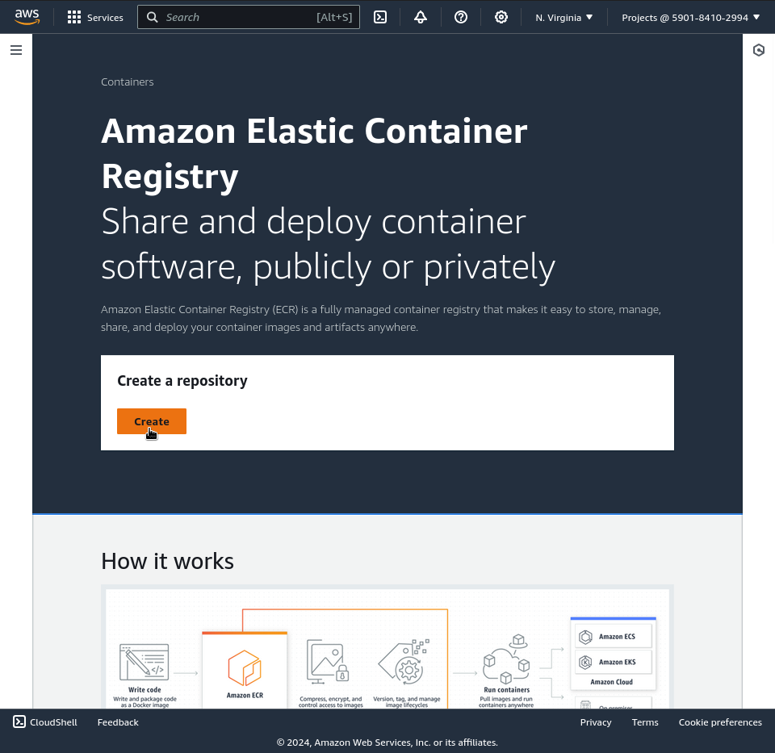
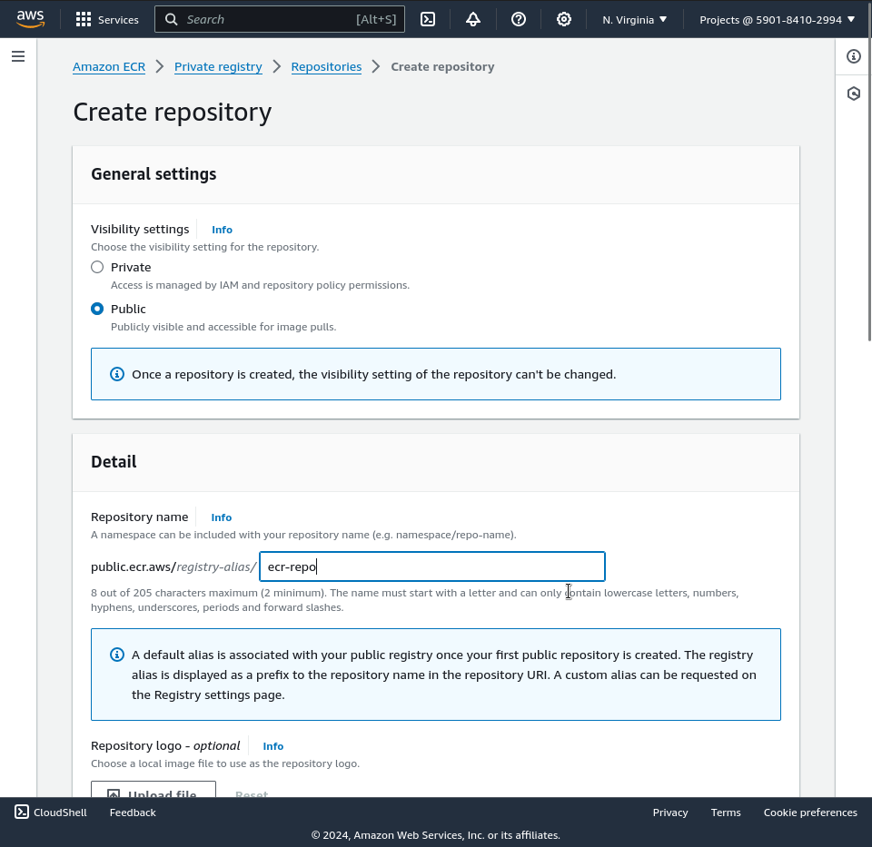
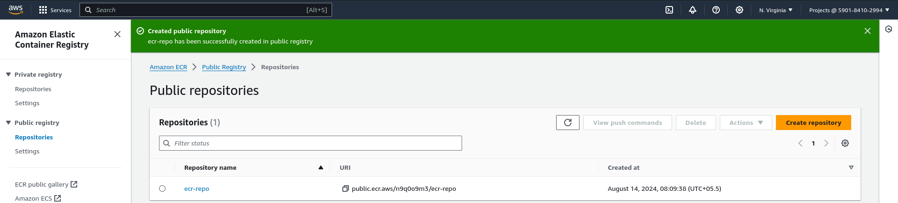
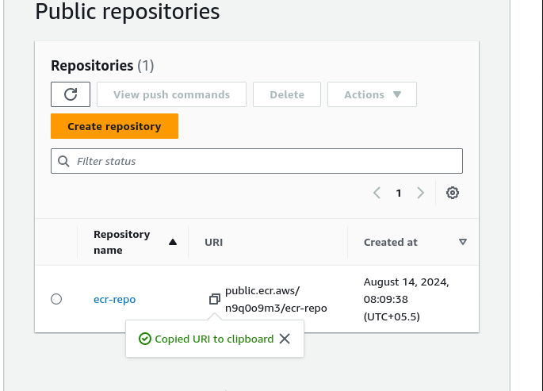
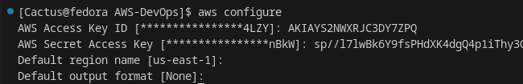
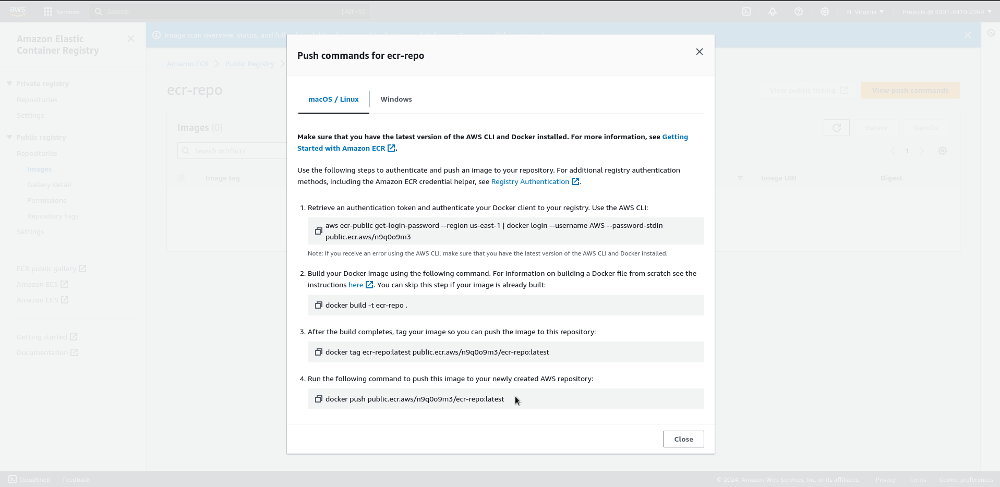
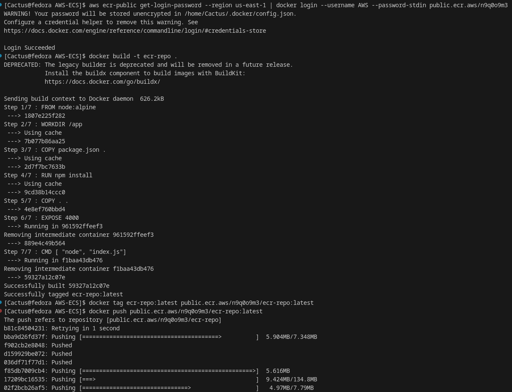

# Pushing Docker Images from Local Machine to AWS – ECR

In this project, we'll learn how to push Docker images from your local machine to Amazon Elastic Container Registry (ECR). AWS ECR is a fully managed Docker container registry that makes it easy to store, manage, and deploy Docker container images.

## Step 1: Create an ECR Repository

## Copy the Repository URL, We'll need this URI in later steps.

## Step 2: Navigate to your created ecr repository and click on push commands.

### In your local terminal make sure that your aws-cli is configured properly and then follow above commands.

AWS uses a token-based authentication system to manage Docker access to ECR.

Follow these commands to authenticate Docker with ECR.  (**YOU WILL REQUIRE AWS-CLI**  in your local system for this to work.)

