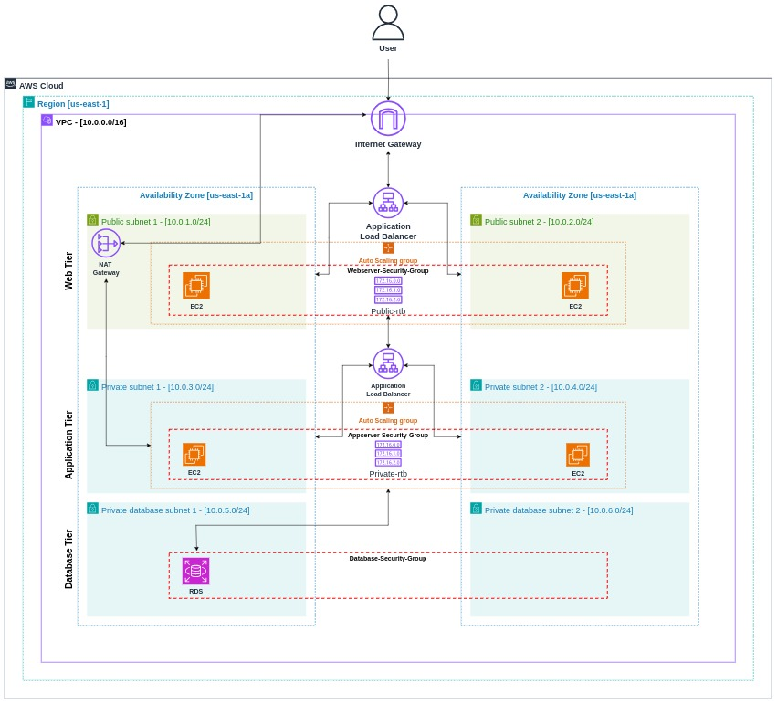

# 📌 Multi-Tier Architecture on AWS using Terraform

Create a scalable and robust multi-tier architecture on AWS utilizing Terraform.

## 📋Index
- [Overview](#🔰-overview)
- [Objective](#🌟-objective)
- [Key Features and Components](#🌠-key-features-and-components)
- [Prerequisites](#🛒-prerequisites)
- [Project Directory Structure](#🧬-project-directory-structure)
- [Terraform Configuration Files](#⚙️-terraform-configuration-files)
   - [Root Module Files](#🧮-root-module-files)
   - [Network Module](#🔌-network-module)
   - [Security Group Module](#🔒-security-group-module)
   - [Load Balancer Module](#⚖️-load-balancer-module)
   - [Auto Scaling Group Module](#🖥️-auto-scaling-group-module)
   - [Database Module](#💾-database-module)
   - [Monitoring Module](#📈-monitoring-module)
- [Deployment Steps](#🚀-deployment-steps)
- [Future Enhancements](#🔭-future-enhancements)
- [Conclusion](#🏁-conclusion)
- [Usage](#-usage)
- [Contributing](#-contributing)
- [License](#-license)

## 🔰 Overview

This project aims to deploy a multi-tier architecture on AWS, consisting of three tiers: the Presentation Layer (Web Tier), the Application Layer, and the Data Layer (Database Tier). Each tier will be deployed using Terraform to automate infrastructure provisioning, configuration, and management. Terraform involves structuring infrastructure into modular layers, each responsible for specific tasks such as networking, security, load balancing, auto-scaling, database management, and monitoring. This approach ensures scalability, security, and maintainability. This article provides a comprehensive guide on setting up a multi-tier architecture using Terraform, covering all aspects from directory structure to deployment and future enhancements.

1. **Web Tier**:

Serves as the entry point for user requests.

2. **Application Tier**:

It contains the application's core logic and processing capabilities and handles business logic, processing user requests, and generating responses. Interacts with the Web Tier and Database Tier.

3. **Database Tier**:

Stores and manages application data persistently. Ensures data integrity, consistency, and durability through backups and replication.

*It's the basic plan of this project to create these tiers. Resulting in a Multi-Tier-Project helping us to eficciently run our applications. We will be using a high standard terraform module approach in this project. (you won't find web, app or database module but a variety of other modules which will be creating all these instances for us)*

### Infrastructure Architecture

Below is a diagram of the architecture we will be deploying:

<p align="center">
    <br>
   Architecture Diagram
</p>

## 🌟 Objective

- **Modularity:** Utilize Terraform modules to encapsulate each tier's components, enabling reusability and maintainability.

- **Scalability:** Implement Auto Scaling Groups to dynamically scale resources based on demand, ensuring optimal performance and cost efficiency.

- **High Availability:** Deploy resources across multiple Availability Zones (AZs) to enhance fault tolerance and maintain continuous availability.

- **Security:** Utilize AWS Identity and Access Management (IAM), security groups, and encryption mechanisms to enforce data security and compliance.

- **Monitoring and Logging:** Integrate AWS CloudWatch for monitoring resource utilization, application performance, and operational metrics.

- **Infrastructure as Code (IaC):** Implement infrastructure deployment and management using Terraform, enabling version-controlled, repeatable, and consistent infrastructure configurations.

## 🌠 Key Features and Components:

### [Networking](./modules/network/)

   * **VPC**: Isolated network for your infrastructure.
   * **Subnets**: Public and private subnets for better segregation.
   * **internet gateway**: It provide two-way public connectivity to applications running in AWS Regions and/or in Local Zones.
   * **route tables**: It contains a set of rules, called routes, that determine where network traffic from your subnet or gateway is directed.

### [Security](./modules/security_group/)

   * **Security Groups**: Control inbound and outbound traffic, ensuring only authorized traffic can reach your resources.

### [Load Balancing](./modules/load_balancer/)

   * **Application Load Balancer (ALB)**: Distributes incoming application traffic across multiple targets (e.g., EC2 instances), improving availability and fault tolerance.

### [Auto Scaling](./modules/auto_scaling_group/)

   * **Auto Scaling Groups**: Automatically adjusts the number of EC2 instances based on demand, ensuring your application can handle varying loads.

### [Database](./modules/database/)

   * **RDS**: Managed relational database service for storing and managing data, with automated backups and updates.

### [Monitoring](./modules/monitoring/)

   * **CloudWatch**: Monitors resources and applications, providing insights and alerting capabilities.

## 🛒 Prerequisites

- **AWS Account**: You need an active AWS account to provision resources and services on the AWS cloud platform.

- **AWS Access Credentials**: Obtain AWS access credentials with appropriate permissions to create and manage resources. This involves creating an IAM user with programmatic access and attaching policies that grant necessary permissions.

- **Terraform Installed**: Install Terraform on your local machine or development environment. 
You can follow this [article on terraform installation](https://medium.com/@Yasholo/terraform-a-guide-ff06bd539040).

- **AWS CLI Installed and Configured**: Install the AWS Command Line Interface (CLI) on your machine and configure it with your AWS access credentials. This allows Terraform to interact with AWS services on your behalf. 
You can follow this [article on AWS CLI Installation.](https://medium.com/@Yasholo/aws-command-line-interface-cli-install-and-configure-8e70e6831074).

- And lastly some basic knowledge of AWS services (VPC, EC2, RDS, ALB, CloudWatch) and Terraform.

## 🧬 Project Directory Structure

Organize your Terraform files and modules into a structured directory for better maintainability:

```shell
    terraform-project/
    │
    ├── main.tf            # Main Terraform configuration file
    ├── variables.tf       # Input variables
    ├── outputs.tf         # Output variables
    ├── terraform.tfvars   # Terraform variable values (optional)
    └── modules/           # Directory for reusable modules (optional)
        ├── network/
        │   ├── main.tf
        │   ├── variables.tf
        │   └── outputs.tf
        ├── security_group/
        │   ├── main.tf
        │   ├── variables.tf
        │   └── outputs.tf
        ├── load_balancer/
        │   ├── main.tf
        │   ├── variables.tf
        │   └── outputs.tf
        ├── auto_scaling_group/
        │   ├── main.tf
        │   ├── variables.tf
        │   └── outputs.tf
        ├── database/
        │   ├── main.tf
        │   ├── variables.tf
        │   └── outputs.tf
        └── monitoring/
            ├── main.tf
            ├── variables.tf
            └── outputs.tf
```

## ⚙️ Terraform Configuration Files
Tip: You can follow the [official terraform aws documentation](https://registry.terraform.io/providers/hashicorp/aws/latest/docs) if you ever get stuck while setting up your resources. (use the search bar to get information about a particular object.)

### 🧮 Root Module Files

The root module serves as the entry point for your Terraform configuration and includes the primary files that define the overall structure and components of your infrastructure. Here's an in-depth look at each of the root module files:

**main.tf** [🔗](./main.tf): 

* **Purpose**: This file is the core of your Terraform configuration. It specifies the provider details and calls various modules to set up different parts of the infrastructure.
* **Components**:

    * **Provider Configuration**: Defines the cloud provider (e.g., AWS) to be used and sets up credentials, regions, and other settings.
    * **Module Calls**: Invokes various modules to create resources such as network, security groups, load balancers, auto-scaling groups, databases, and monitoring.

**variables.tf** [🔗](./variables.tf): 

* **Purpose**: Contains all the variable definitions used throughout the Terraform configuration. These variables allow for customizable input values without hardcoding them in the configuration files.
* **Components**:

    * **Variable Declarations**: Defines variables with descriptions, types, and default values (if any). This helps in making the Terraform configuration flexible and reusable.

**outputs.tf** [🔗](./outputs.tf):

* **Purpose**: Defines the output values from the root module. These outputs can be used to display important information after the infrastructure is provisioned or to pass values between modules.
* **Components**:

    * **Output Declarations**: Specifies the values to be output after the deployment, such as IDs and ARNs of created resources.

**terraform.tfvars** [🔗](./terraform.tfvars):

* **Purpose**: Provides the actual values for the variables defined in variables.tf. This file is used to set specific values for different environments or configurations without altering the main configuration files.
* **Components**:

    * **Variable Assignments**: Assigns values to the variables declared in '**variables.tf**', allowing for environment-specific configurations.


### 🗂️ Modules

Modules are self-contained packages of Terraform configurations that are managed as a group. Each module has its own set of Terraform files that define resources, variables, and outputs. Here's a detailed look at each module and its purpose:

### 🔌 Network Module [🔗](./modules/network/)

**Purpose**: Sets up the networking components, including VPC, subnets, internet gateway, and route tables.

   * [**main.tf**](./modules/network/main.tf): Defines resources for creating VPC, subnets (both public and private), internet gateway, and route tables.

   * [**variables.tf**](./modules/network/variables.tf): Declares variables for the network settings, such as VPC CIDR block and subnet CIDRs.

   * [**outputs.tf**](./modules/network/outputs.tf): Outputs relevant information like VPC ID, subnet IDs, and route table IDs.


### 🔒 Security Group Module [🔗](./modules/security_group/)

**Purpose**: Manages security groups to control inbound and outbound traffic.

   * [**main.tf**](./modules/security_group/main.tf): Defines resources for creating security groups with specific rules for inbound and outbound traffic.
   * [**variables.tf**](./modules/security_group/variables.tf): Declares variables for security group settings, such as allowed IP ranges and ports.
   * [**outputs.tf**](./modules/security_group/outputs.tf): Outputs the security group IDs.

### ⚖️ Load Balancer Module [🔗](./modules/load_balancer/)

**Purpose**: Sets up an Application Load Balancer (ALB) to distribute incoming traffic across multiple targets.

   * [**main.tf**](./modules/load_balancer/main.tf): Defines resources for creating an ALB, target groups, and listeners.
   * [**variables.tf**](./modules/load_balancer/variables.tf): Declares variables for load balancer settings, such as VPC ID and subnet IDs.
   * [**outputs.tf**](./modules/load_balancer/outputs.tf): Outputs the ALB DNS name and target group ARNs.

### 🖥️ Auto Scaling Group Module [🔗](./modules/auto_scaling_group/)

**Purpose**: Manages auto-scaling groups to ensure the appropriate number of EC2 instances are running to handle the load.

   * [**main.tf**](./modules/auto_scaling_group/main.tf): Defines resources for creating auto-scaling groups, launch configurations, and scaling policies.
   * [**variables.tf**](./modules/auto_scaling_group/variables.tf): Declares variables for auto-scaling settings, such as VPC ID, subnet IDs, and desired capacity.
   * [**outputs.tf**](./modules/auto_scaling_group/outputs.tf): Outputs the auto-scaling group name and instance details.

### 💾 Database Module [🔗](./modules/database/)

**Purpose**: Sets up a managed relational database service (RDS) for storing and managing data.

   * [**main.tf**](./modules/database/main.tf): Defines resources for creating an RDS instance, including subnet groups and security groups.
   * [**variables.tf**](./modules/database/variables.tf): Declares variables for database settings, such as database name, username, password, and instance type.
   * [**outputs.tf**](./modules/database/outputs.tf): Outputs the database endpoint and instance details.

### 📈 Monitoring Module [🔗](./modules/monitoring/)

**Purpose**: Configures monitoring and logging services to track the performance and health of the infrastructure.

   * [**main.tf**](./modules/monitoring/main.tf): Defines resources for setting up CloudWatch log groups and metrics.
   * [**variables.tf**](./modules/monitoring/variables.tf): Declares variables for monitoring settings.
   * [**outputs.tf**](./modules/monitoring/outputs.tf): Outputs relevant monitoring details such as log group names.

## 🚀 Deployment Steps

To deploy the project, follow these steps:

1. Install Terraform on your local machine.
2. Set up AWS credentials with appropriate permissions.
3. Navigate to the project directory and initialize Terraform. 
```shell
terraform init
```
4. Validate the configuration files.
```shell 
terraform validate
```
5. Generate and review an execution plan. 
```shell
terraform plan
```

6. Apply the changes to provision the infrastructure.
```shell
terraform apply
```
*You can also run this script if you don't want to do it one by one manually... [start_terraform.sh](./start_terraform.sh)*

7. After deployment, access the web application using the **Load Balancer's DNS name**.

## 🔭 Future Enhancements

**Automation**

Implement CI/CD pipelines for automated deployments and updates, improving development efficiency and reducing the risk of human errors.
Advanced Monitoring

**Advanced Monitoring**

Integrate more comprehensive monitoring and alerting systems, using services like AWS CloudWatch and third-party tools.
Backup and Recovery

**Backup and Recovery**

Implement automated backup and recovery processes for critical data, ensuring data integrity and availability.
Infrastructure as Code (IaC) Best Practices

**Infrastructure as Code (IaC) Best Practices**

Continuously improve code quality by following IaC best practices, such as version control, code reviews, and automated testing.
Expand Services

**Expand Services**

Add more AWS services as needed, such as S3 for storage, Lambda for serverless computing, and more, to enhance the functionality and performance of your applications.

**Container Orchestration**

Implement container orchestration platforms like Amazon ECS or Kubernetes for containerized workloads.

**Advanced Monitoring**

Enhance monitoring and observability with AWS X-Ray, AWS CloudTrail, and third-party monitoring tools.

## 🏁 Conclusion
By following this comprehensive guide, you can create a robust, scalable, and secure multi-tier architecture on AWS using Terraform. This modular approach ensures that your infrastructure is maintainable and adaptable to future requirements. Embrace Terraform and AWS to enhance your infrastructure management and streamline your deployment processes.