# Automated Infrastructure (VPC Setup) with AWS CloudFormation 

## Overview
This project uses AWS CloudFormation to automate the creation of a VPC and subnet, demonstrating Infrastructure as Code (IaC) skills.

## What It Does
- Provisions a VPC (CIDR: `10.0.0.0/16`) and a subnet (`10.0.1.0/24`) in `us-east-1a` availability zone, using a single YAML template.
- Provides a repeatable, scalable and version-controlled way to manage AWS resources.

## How I Built It

1. **Template Creation**: Wrote `vpc-template.yaml` defining a VPC (`MyVPC`) and subnet (`MySubnet`) with CIDR blocks and tags.

  ```yaml
  AWSTemplateFormatVersion: '2010-09-09'
  Description: Simple VPC and Subnet
  Resources:
    MyVPC:
      Type: AWS::EC2::VPC
      Properties:
        CidrBlock: 10.0.0.0/16
        EnableDnsSupport: true
        EnableDnsHostnames: true
        Tags:
          - Key: Name
            Value: MyVPC
    MySubnet:
      Type: AWS::EC2::Subnet
      Properties:
        VpcId: !Ref MyVPC
        CidrBlock: 10.0.1.0/24
        AvailabilityZone: us-east-1a
        Tags:
          - Key: Name
            Value: MySubnet
  Outputs:
    VpcId:
      Description: ID of the VPC
      Value: !Ref MyVPC
    SubnetId:
      Description: ID of the Subnet
      Value: !Ref MySubnet
  ```
  - What It Does:  
      - VPC: 10.0.0.0/16 (65,536 IPs).  
      - Subnet: 10.0.1.0/24 (256 IPs) in us-east-1a.  
      - Outputs: Returns VPC and subnet IDs for reference.


2. **Deployment**: Uploaded the template to CloudFormation in AWS Console and deployed the stack.

    - Log into AWS Console: Go to CloudFormation.  
      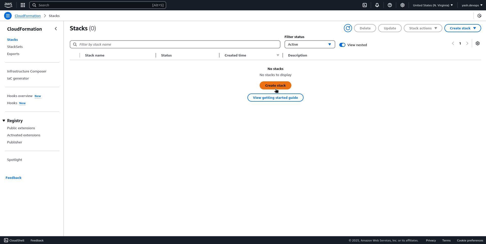
    - Create Stack:  
      - Click “Create stack” > “With new resources (standard).”  
        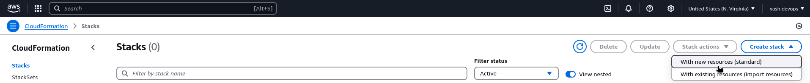
      - Template Source: “Upload a template file.” 
      - Upload vpc-template.yaml.  
      - Click “Next.”
        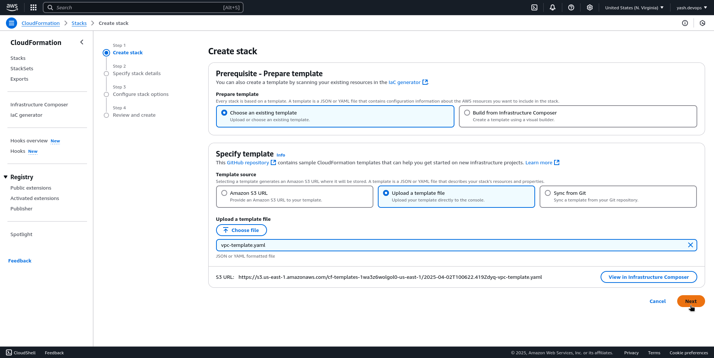
    - Stack Details:  
      - Stack Name: MyVPCStack (or your choice).  
        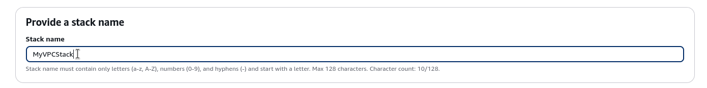
    - Options:  
      - No changes needed—click “Next.”
    - Review & Create:  
      - Check “I acknowledge…” (for IAM permissions—safe here).  
      - Click “Submit”
        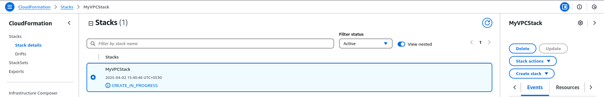

    - Wait: It takes about 2-5 minutes to build. Watch the “Events” tab—status should go to CREATE_COMPLETE.
      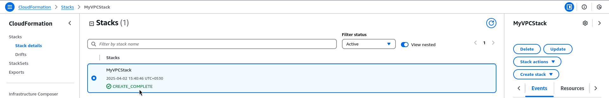

3. **Validation**:
  - CloudFormation:  
    - Go to Stacks > MyVPCStack > “Resources” tab.  - See MyVPC (VPC ID, e.g., vpc-0d50b3efad9e9d4cb) and MySubnet (Subnet ID, e.g., subnet-0ca7843848f410c1d).
      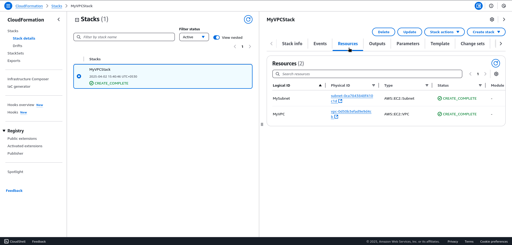
  
  - VPC Console:  
    - VPC > Your VPCs: Look for “MyVPC” with CIDR 10.0.0.0/16.  
      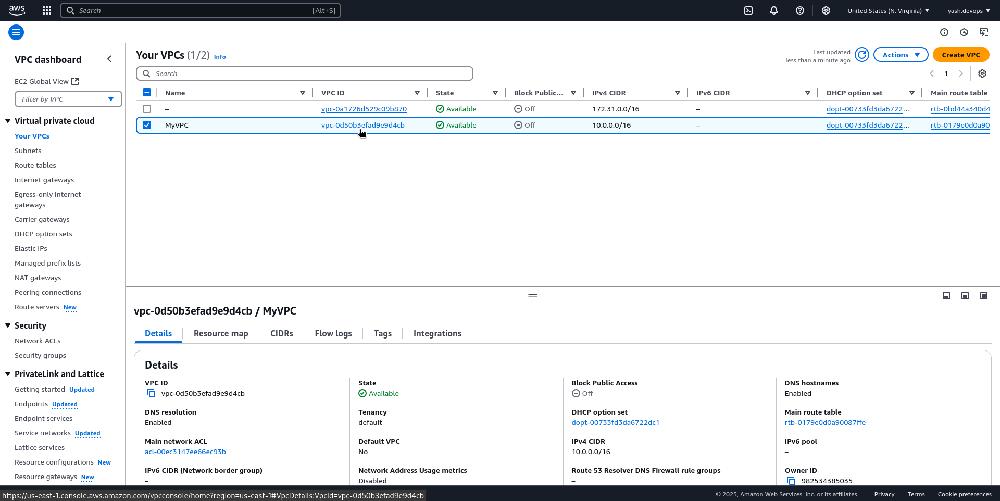
    - VPC > Subnets: Find “MySubnet” in us-east-1a with 10.0.1.0/24.
      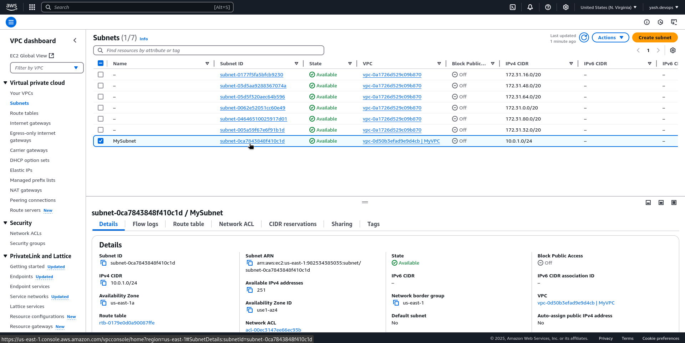
    
  - Outputs:  
    - CloudFormation > MyVPCStack > “Outputs” tab: Note the VPC and Subnet IDs.
      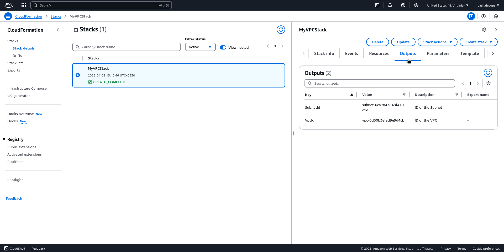

4. **Clean Up (Optional)**: When done, delete the stack to avoid clutter:  
  - CloudFormation > Stacks > MyVPCStack > “Delete” > Confirm.  
    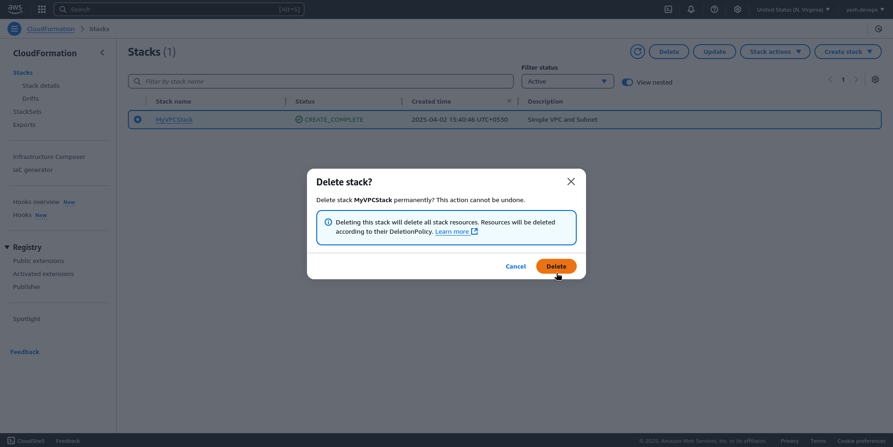
  - Takes about 2 minutes for resources to vanish.


## Tools Used
- AWS Free Tier (CloudFormation, VPC)  
- Text editor (e.g., VS Code, Notepad) 
- YAML

## Setup Instructions
- Clone this repo.
- Save `vpc-template.yaml` locally.
- In AWS CloudFormation, create a stack: upload the template, name it (e.g., `MyVPCStack`), and deploy.
- Verify in VPC console: look for `MyVPC` and `MySubnet`.
- Delete the stack when done to clean up.

## Outcome
An automated VPC setup, proving IaC skills. 

p.s. You can add an EC2 instance to the template and redeploy. This will create an ec2 instance and you can assign it the same vpc and subnet!


## Demo

