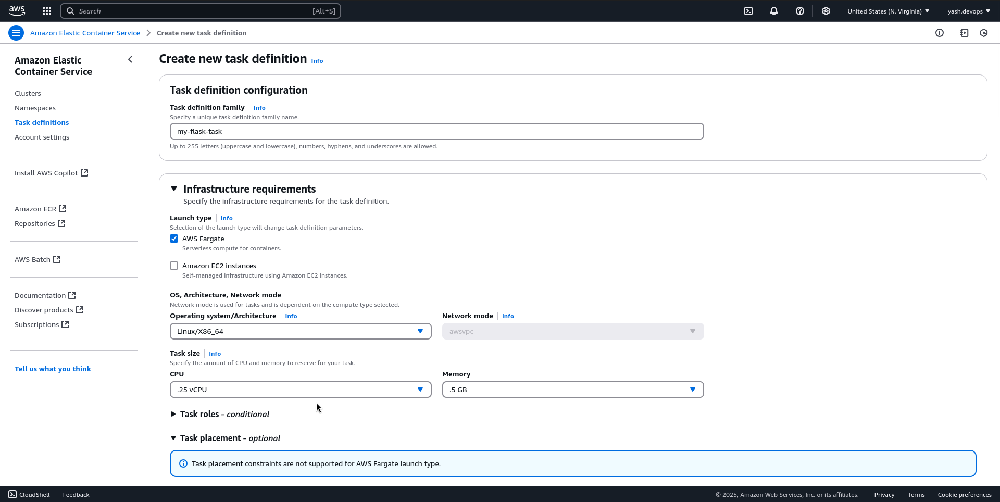

# CI/CD Pipeline with GitHub Actions and AWS ECS

## Overview
This project automates deployment of a Python Flask app to AWS ECS (Fargate) using GitHub Actions, showcasing CI/CD, containerization, and cloud orchestration.

## What It Does
- Deploys a "Hello, DevOps!" Flask app to ECS whenever code is pushed to the `main` branch.
- Uses Docker, ECR for container storage, and GitHub Actions for CI/CD.
- Provides a live endpoint for the app (e.g., "Hello, DevOps!").

## Features
- **Flask App**: A simple "Hello, DevOps!" web app running on port 5000.
- **Docker**: Containerized app for consistent deployment.
- **AWS ECS (Fargate)**: Serverless container orchestration.
- **AWS ECR**: Private repository for Docker images.
- **GitHub Actions**: CI/CD pipeline to build, push, and deploy on code push to `main`.

## Prerequisites
- **AWS Free Tier Account**: With AWS CLI configured. ([Use this article to configure aws cli in your system](https://medium.com/@Yasholo/aws-command-line-interface-cli-install-and-configure-8e70e6831074))
- **Docker**: Installed locally.
- **GitHub Account**: For the repository.
- **Git**: For version control.
- **Python**: Optional for local testing.

## How I Built It

1. **App Development**: 
    - **Create A Simple App**: Write a Python Flask app (`app.py`) and requirements file (`requirements.txt`).
        - app.py
        ```python
        from flask import Flask
        app = Flask(__name__)
        @app.route('/')
        def hello():
            return "Hello, DevOps!"
        if __name__ == "__main__":
            app.run(host="0.0.0.0", port=5000)
        ```
        - requirements.py
        ```
        Flask==3.0.3
        ```
    - **Dockerized it**: Add a Dockerfile (`Dockerfile`).
        ```dockerfile
        FROM python:3.9-slim
        WORKDIR /app
        COPY . .
        RUN pip install -r requirements.txt
        CMD ["python", "app.py"]
        EXPOSE 5000.
        ```

2. **Test Locally (Optional)**:
    - Install Docker: If not installed already. *sudo yum install docker*
    - Build & Run:
        ```bash
        docker build -t my-flask-app .
        docker run -p 5000:5000 my-flask-app
        ```
        
        
        

    - When we visit http://localhost:5000 , it should say “Hello, DevOps!”.
        

<!-- 
3. **Push to Github**: Create a repo, push your app and Dockerfile.

     
-->

3. **Set Up AWS Resources**: 
    1. **ECR (Elastic Container Registry):** 
        - AWS Console > ECR > “Create repository.”  
            
        - Name: `my-flask-app` 
        - Copy the URI (e.g., < account-id >.dkr.ecr.us-east-1.amazonaws.com/my-flask-app).
            
        - Verify: ECR > my-flask-app > Ensure it exists.
        
        - **Push Docker Image to ECR**: For now we will do it manually and later on use CI/CD pipeline to automate it!

            Make sure you have aws-cli and docker installed and configured before moving forward! [Use this article to configure aws cli in your system](https://medium.com/@Yasholo/aws-command-line-interface-cli-install-and-configure-8e70e6831074)

            You can click on 'View push commands' for ease of work and error free commands.

            ```bash
            aws ecr get-login-password --region us-east-1 | docker login --username AWS --password-stdin <account-id>.dkr.ecr.us-east-1.amazonaws.com
            
            docker build -t my-flask-app .
            
            docker tag my-flask-app:latest <account-id>.dkr.ecr.us-east-1.amazonaws.com/my-flask-app:latest
            
            docker push <account-id>.dkr.ecr.us-east-1.amazonaws.com/my-flask-app:latest
            ```
            - 

            - 
    
    2. **ECS Cluster:**  
        - ECS > Clusters > “Create cluster.”  
        - Template: “Networking only” (Fargate)
        - Name: `my-ecs-cluster` 
        - Create
            
            
            

    3. **Task Definition:**  
        - ECS > Task Definitions > “Create new task definition.”  
            
        - Family: `my-flask-task`
        - Launch Type: Fargate  
        - CPU: 0.25 vCPU, Memory: 0.5 GB (Free Tier).  
        - Container: 
            - Name: `flask-container`  
            - Image: <account-id>.dkr.ecr.us-east-1.amazonaws.com/my-flask-app:latest (from ECR).  
            - Port mappings: 5000 (Host & Container).
        - Save & Create.
            
            
            

    4. **ECS Service:**  
        - ECS > Clusters > my-ecs-cluster > “Create” under Services.  
            
        - Launch Type: `Fargate`  
        - Task Definition: `my-flask-task` (latest revision).  
        - Service Name: `my-flask-service`  
        - Number of tasks: 1  
            
        - VPC: Default VPC, select 2 subnets (e.g., us-east-1a, us-east-1b).  
        - Security Group: Create new, allow HTTP (port 5000, 0.0.0.0/0).  
        - Load Balancer: Skip for now (Free Tier) we’ll use the public IP.  
            
        - Create Service. (It may take several minutes to deploy)
            
            
            - (You can come across many errors like I encountered, don't loose your calm, you will solve it eventually!) 
            
            > *The reason for this error was my docker image not being pushed into ECR repository! Which I didn't do, as I wanted to automate the process. But to keep the project simple and not so confusing I then manually pushed the image into ecr... Later on in the project we will automate it. If you follow all the above steps properly you shouldn't be facing this error. Please verify it properly before moving forward!*

    5. **Get Public IP:** 
        - ECS > my-ecs-cluster > my-flask-service > Tasks > Click the task.

        - Note the “Public IP” (e.g., 3.90.248.3) 

        - Test later by visiting https://< public-ip >:5000 (e.g, http://3.90.248.3:5000)
            


4. **Set Up Github Actions (CI/alt textCD Pipeline)**: 
    Configure `.github/workflows/deploy.yml` to build, push to ECR, and update ECS on commits.

    - File: `.github/workflows/deploy.yml` in parent repository (`CI-CD-Pipeline-with-Github-Actions-and-ECS`)
    ```yaml
        name: Deploy to ECS
        on:
            push:
                branches: [ main ]
        jobs:
            deploy:
                runs-on: ubuntu-latest
                steps:
                - uses: actions/checkout@v3
                - name: Configure AWS Credentials
                    uses: aws-actions/configure-aws-credentials@v2
                    with:
                        aws-access-key-id: ${{ secrets.AWS_ACCESS_KEY_ID }}
                        aws-secret-access-key: ${{ secrets.AWS_SECRET_ACCESS_KEY }}
                        aws-region: us-east-1
                - name: Build, Tag, Push to ECR
                    run: |
                        docker build -t my-flask-app .
                        aws ecr get-login-password --region us-east-1 | docker login --username AWS --password-stdin <account-id>.dkr.ecr.us-east-1.amazonaws.com
                        docker tag my-flask-app:latest <account-id>.dkr.ecr.us-east-1.amazonaws.com/my-flask-app:latest
                        docker push <account-id>.dkr.ecr.us-east-1.amazonaws.com/my-flask-app:latest
                - name: Update ECS Service
                    run: |
                        aws ecs update-service --cluster my-ecs-cluster --service my-flask-service --force-new-deployment
    ```
    - **AWS Credentials:**
        - IAM > Users > Create user `github-actions-user`.
            
        - Attach policies: `AmazonECS_FullAccess`, `AmazonEC2ContainerRegistryFullAccess`.
            
            
        - Generate an **Access Key** (note **Access Key** ID and **Secret Access Key**).
        - **GitHub** > **Repository**(create a new github repo for this project to keep it simple) > **Settings** > **Secrets and variables** > **Actions**:
            - Add `AWS_ACCESS_KEY_ID`.
            - Add `AWS_SECRET_ACCESS_KEY`.          
            

    *Note: Replace `<account-id>` in `deploy.yml` with your AWS Account ID.*


5. **Push to Github and Test**: 
    - **Repo**: Create `ecs-cicd` on Github.
    - **Push**: Push the code to GitHub to trigger the CI/CD pipeline.
        ``` bash
        cd CI-CD-Pipeline-with-Github-Actions-and-ECS (the repository which contains all your files)
        git init
        git add app.py requirements.txt Dockerfile .github/workflows/deploy.yml
        git commit -m "Initial ECS CI/CD setup"
        git remote add origin https://github.com/[YourUsername]/ecs-cicd.git
        git branch -M main
        git push -u origin main
        ```
        
        

    - **Verify**:
        - GitHub > Actions: Monitor the Deploy to ECS workflow.
            
            

        - ECR > my-flask-app: Confirm the latest image is updated.
            

        - ECS > my-flask-service > Tasks: Check for a RUNNING task.
            
            

        - Test: Visit `http://<public-ip>:5000` to see “Hello, DevOps!”.
            

6. **Clean Up**:
    To avoid AWS charges:
    - **ECS**: Delete my-flask-service and my-ecs-cluster.
    - **ECR**: Delete my-flask-app repository.
    - **IAM**: Remove any user you created for this project and its access keys.


## Outcome
- A fully automated app deployment pipeline.  
- Portfolio: Link the GitHub repo, demo the live app.

## Demo
[Insert ECS public IP or screenshot, e.g., `http://54.321.98.76:5000`]

- output after manually pushing docker image to ecr
    

- output using github actions, where I modified the app.py a little.
    


## Setup Instructions
- Clone this repo.
- Set up ECR, ECS cluster, task definition, and service in AWS (Fargate, port 5000).
- Add AWS credentials to GitHub Secrets (`AWS_ACCESS_KEY_ID`, `AWS_SECRET_ACCESS_KEY`).
- Update `deploy.yml` with your ECR URI and ECS details.
- Push to `main` to trigger deployment.
- Test at the ECS task’s public IP.