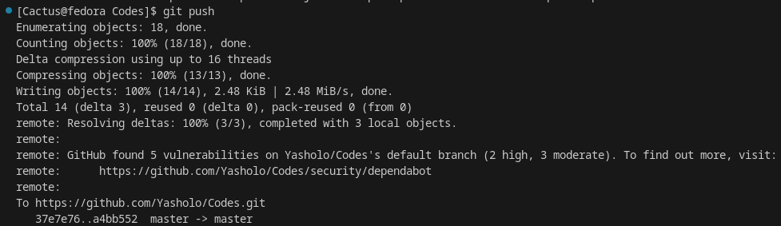
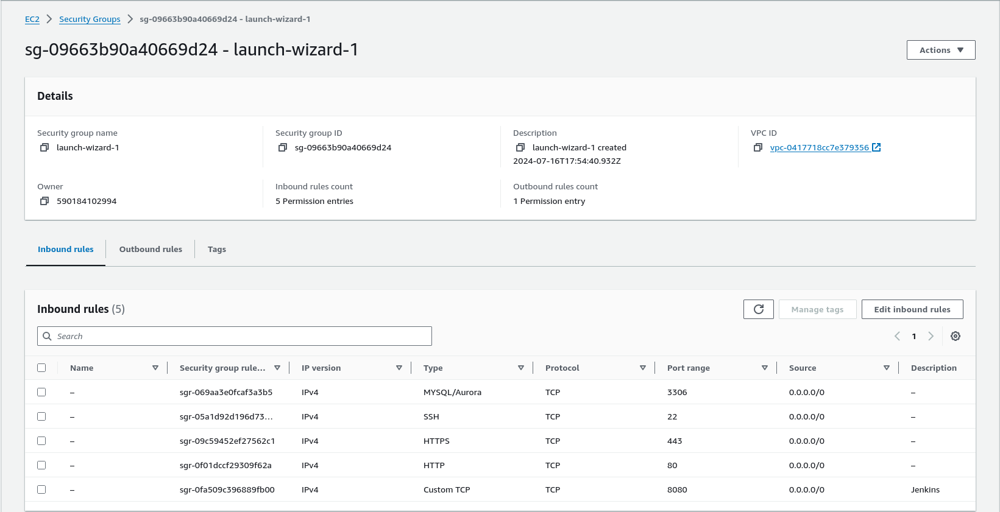

# Building a DevOps Pipeline with Jenkins

In the modern software development landscape, continuous integration and continuous deployment (CI/CD) pipelines are essential for delivering high-quality applications efficiently. This article walks through the process of setting up a CI/CD pipeline using Jenkins, AWS, Git. We will use a *Python app along with HTML and SQL*. The pipeline will automate the build, test, and deployment of a simple web application that interacts with a MySQL database.

## Prerequisites

- AWS Account: An active AWS account.
- GitHub Account: For hosting the code repository.
- Jenkins Server: A running Jenkins instance. (We will be learning to do that later in the project.)
- Basic Knowledge: Familiarity with Git, Docker, and AWS services. That bare minimum to ask for ;)

## Steps to Proceed:

**Step 1: Create a Basic Web Application**

We’ll start by creating a simple web application using Python and Flask, which will connect to a MySQL database.

[app.py](./app.py) 

Now we will create a requirements.txt file for our Python app.

[requirements.txt](./requirements.txt)

We also need a frontend for our app, lets create it using html :)

[templates/index.html](./templates/index.html)

[templates/new_post.html](./templates/new_post.html)

[templates/post.html](./templates/post.html)

Finally a Dockerfile which will help us containerize our Application and standardize it. Which will help in scalability and flexibility of our app.

[Dockerfile](./Dockerfile)

**Step 2: Push all our Code to GitHub**
We want to do this so that we can use these codes in our
Jenkins Pipeline.

- Initialize a Git repository in the project directory.
- Commit the code.
- Push the code to a GitHub repository.

``` bash 
git init
git add .
git commit -m "Initial commit"
git remote add origin https://github.com/yourusername/myapp.git
git push -u origin master
```



**Step 3: Set Up AWS Environment**

1. **Launch an EC2 Instance**: Choose a suitable instance type (I chose ubuntu), configure security groups to allow HTTP (port 80) and MySQL (port 3306) traffic (You can do this in the inboud rules setting of your security group).
    

    

2. **Install Docker**: Connect to your created instance (I have an instance with ubuntu distros) and install Docker.
```bash
sudo apt update
sudo apt install docker.io -y
sudo systemctl start docker #Start Docker.
sudo systemctl enable docker #Ensure it in running.
```


 You Can see our docker is up and running.

3. **Install MySQL**: We will install MySQL on our EC2 Instance.
```bash
sudo apt install mysql-server -y
sudo systemctl start mysql
sudo systemctl enable mysql
```


 Our Mysql server is up and running.

4. **Set Up Database**: 

Connect to your mysql server and setup your root passward.
```bash
sudo mysql
```
```
FLUSH PRIVILEGES;
ALTER USER 'root'@'localhost' IDENTIFIED BY 'yournewpassword';
```


Now use this new password to log into ur mysql root server.
```bash
mysql -u root -p
```


Run the following SQL commands to set up the database:
```sql
CREATE DATABASE My_database;
USE My_database;

CREATE TABLE posts (
    id INT AUTO_INCREMENT PRIMARY KEY,
    title VARCHAR(100) NOT NULL,
    content TEXT NOT NULL,
    created_at TIMESTAMP DEFAULT CURRENT_TIMESTAMP
);

INSERT INTO posts (title, content) VALUES ('First Post', 'This is the content of the first post.');
INSERT INTO posts (title, content) VALUES ('Second Post', 'This is the content of the second post.');
```


Exit mysql after creating the database. Let's move on to the next step.

**Step 4: Set Up Jenkins**

1. **Install Jenkins**: On your Ec2 instance install Jenkins. 
(You can follow this article for help: [Installing Jenkins on Linux systems](https://medium.com/@Yasholo/installing-jenkins-on-linux-systems-d350e5c0b676))

 Checking if Jenkins is Installed on our system.

 Status of your Jenkins.

2. **Configure Jenkins**: 
    - Access Jenkins through the web interface. 
    (Make sure port 8080 is accessible.)
    In your browser go to: http://your_server_ip_or_domain:8080

        

        

    - Complete the setup wizard, follow all the required steps on the screen and install necessary plugins.
        

    - After completing your setup and setting your username and password. Your sign in window will appear!

        Sign in using the username and password you just created.
        

        ### Hurray! You have successfully loged into your Jenkins.
        

3. **Create a Jenkins Pipeline**:
    Now we will create a new pipeline job in Jenkins and configure it to use the Jenkinsfile from our repository.

# STUPID AWS!!! GOT STUCK :( 
    (Probably due to resources constrain or idk. I don't have time to debug rn.)
    

