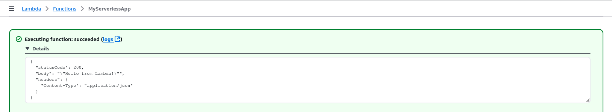
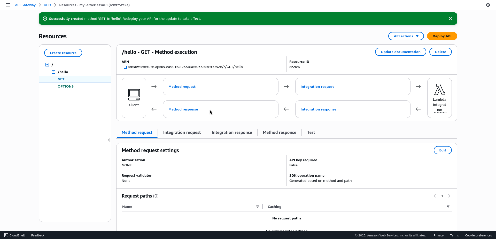

# Serverless API with AWS Lambda and API Gateway

## Overview
This project creates a serverless API using AWS Lambda and API Gateway, demonstrating modern cloud architecture.

## What It Does
- Exposes a simple GET endpoint that returns a JSON message ("Hello from Lambda!").
- Runs without managing servers, leveraging AWS’s serverless stack.

## Features

## Prerequisites
- AWS Lambda (Free Tier)
- AWS API Gateway (Free Tier)
- Python

## How I Built It
1. **Write the Lambda Function**: Create a Python script for the Lambda function, including the bonus feature to handle query parameters, returning a JSON response.
    File: `lambda_function.py`
    ```python
        import json

        def lambda_handler(event, context):
            # Extract query parameters (if any)
            query_params = event.get("queryStringParameters", {}) or {}
            name = query_params.get("name", "Lambda")  # Default to "Lambda" if no name provided

            # Create response message
            message = f"Hello from {name}!"

            return {
                "statusCode": 200,
                "body": json.dumps(message),
                "headers": {
                    "Content-Type": "application/json"
                }
            }
    ```
    ***Notes:***
    - Handles name query parameter (e.g., ?name=DevOps returns "Hello from DevOps!").
    - Default message: "Hello from Lambda!" if no parameter.
    - Includes headers for proper API Gateway response.


2. **Deploy the Lambda Function**: Upload the function to AWS Lambda.
    
    **Steps:**
    - **AWS Console > Lambda > Create function**.
        

        - **Function name**: `MyServerlessApp`.
        - **Runtime**: Python 3.9.
        - **Execution role**: Create a new role with basic Lambda permissions (auto-generated).
        - Click **Create** function.

        
        

    - **Upload Code**:
        - In the Code tab, select Upload from > .zip file.
        - Create a `.zip`:
            - Save `lambda_function.py` in a folder.
            - Zip the folder: `zip -r lambda_function.zip lambda_function.py`.
            
            
        - Upload `lambda_function.zip`.
            
        - Set **Handler**: `lambda_function.lambda_handler`.
            
        - Click **Deploy**.
        
    - **Test the Function**:
        - **Test** tab > **Create new test event**.
        - Event name: `TestEvent`.
        - Sample event JSON:
            ```json
            {
                "queryStringParameters": {
                    "name": "DevOps"
                }
            }
            ```
        - Click **Test**.
            
        - **Expected Output**:
            ```json
            {
                "statusCode": 200,
                "body": "\"Hello from DevOps!\"",
                "headers": {
                    "Content-Type": "application/json"
                }
            }
            ```
            
        - Test without parameters (empty {}) to get "Hello from Lambda!".
            
            

    - **Verify**:
        - If the test fails, check the **Execution results** or **CloudWatch Logs** (linked in the **Monitoring** tab) for errors (e.g., syntax issues in `lambda_function.py`).

3. **Set Up API Gateway**: Linked the function to an API Gateway GET method and deployed it to a public URL.

   **Steps:**
    - **AWS Console > API Gateway > Create API**.
        
        - Choose **REST API** (not HTTP API) > **Build**.
            
        - **API name**: `MyServerlessAPI`.
        - **Endpoint Type**: Regional.
        - Click **Create API**.
            

    - **Create Resource and Method**:
        - **Actions > Create Resource**.
            
            - Resource Name: `hello`.
            - Resource Path:` /hello`.
            - Enable **CORS** (optional for browser testing).
            - Click **Create Resource**.
                


        - Select `/hello` > **Actions** > **Create Method**.
            
            - Method: **GET**.
            - Integration Type: **Lambda Function**.
            - Region: `us-east-1`.
            - Lambda Function: `MyServerlessApp`.
            - Click **Create Method**
                
                

    - **Configure Method**:
        - Click **GET** > **Integration Request**.
            
        - Check **Use Lambda Proxy integration** (enables query parameters).
        - Click **Save**.
            

    - Deploy API:
        - **Actions** > **Deploy API**.
            
        - **Deployment stage**: New Stage.
        - **Stage name**: `prod`.
        - Click `Deploy`.
            
        - Note the **Invoke URL** (e.g., https://o9xtt5zs2e.execute-api.us-east-1.amazonaws.com/prod).
            

    - **Verify**:
        - Test the URL in a browser or `curl`
            - `https://<invoke-url>/prod/hello` → "Hello from Lambda!"
                
            - `https://<invoke-url>/prod/hello?name=DevOps` → "Hello from DevOps!"
                
        
        - If it fails, check:
            - **API Gateway** > **Logs/Tracing** (enable CloudWatch Logs if needed).
            - **Lambda** > **Monitoring** > **CloudWatch Logs** for errors.

4. **Bonus: Query Parameters**
    - Already implemented in `lambda_function.py`:
        - Handles `?name=<value>` (e.g., `?name=DevOps`).
        - Defaults to "Lambda" if no name parameter.
        
    - **Test**:
        - curl `https://<invoke-url>/prod/hello?name=YourName`
        - Expected: "Hello from YourName!"
            

5. **Clean Up**
To avoid Free Tier charges:

- **Lambda**: Delete `MyServerlessApp`.
- **API Gateway**: Delete `MyServerlessAPI`.
- **IAM**: Remove the Lambda execution role if not reused.

## Outcome

## Setup Instructions
- Clone this repo.
- Upload `lambda_function.py` to a new Lambda function.
- Configure API Gateway per AWS docs and deploy.

## Demo
**Without parameters**
    

**With parameters**
    