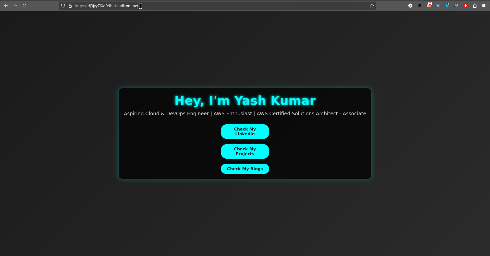
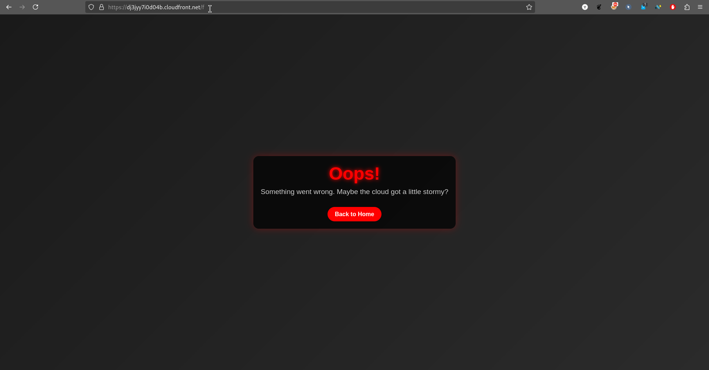

# Static Website on AWS S3 with CloudFront

## Overview
This project hosts a modern, animated personal portfolio website using AWS S3 for storage and CloudFront as a content delivery network (CDN). It demonstrates basic cloud hosting and content distribution skills with a stylish twist.

## What It Does
- Displays a single-page portfolio with a dark theme, glowing text animations, and a call-to-action button linking to my Linkedin, gitHub, blog accessible globally via a CloudFront URL.
- (Optional) Serves a custom error page (`error.html`) for 404s or other issues, maintaining the sleek aesthetic.
- Uses S3 for cost-effective storage, static hosting and CloudFront for fast, cached global delivery.

## How I Built It

1. **Website Design**: Created `index.html` with embedded CSS for a sleek, animated layout (dark gradient background, cyan accents) and an optional `error.html` for errors (red-themed).

2. **S3 Setup**: 

    Made an S3 bucket (`my.portfolio.site`)
        

    Enabled static website hosting
        
    
    Uploaded `index.html` and optional `error.html`
        
        
    Set `index.html` as the index and `error.html` (optional) as the error document, 
        

    Ensured public read access.
        
        
        

3. **CloudFront Integration**: 
        

    Configured a CloudFront distribution with the S3 bucket as the origin
        
        

    optionally added a custom 404 error response to serve `error.html`
        
    
    Deployed it to generate a public URL.
        
        
        

4. **Testing**: Confirmed the site loads via the CloudFront domain (e.g., `https://dj3jyy7i0d04b.cloudfront.net`) and optionally the error page triggers on invalid paths (e.g., `/dgf`).

## Tools Used
- AWS S3 (Free Tier)
- AWS CloudFront (Free Tier)
- HTML/CSS (self-contained in `index.html` and optional `error.html`)

## Setup Instructions
- Clone this repo.
- Upload `index.html` and optional `error.html` to your S3 bucket with public access enabled.
- In S3, enable static website hosting, set `index.html` as the index document and optionally `error.html` as the error document.
- Set up CloudFront with the bucket as the origin, optionally add a 404 custom error response pointing to `/error.html`, and deploy.
- Customize the name and GitHub link in `index.html`.

## Demo

WORKING WEBSITE ON CLOUDFRONT

Optional error page

