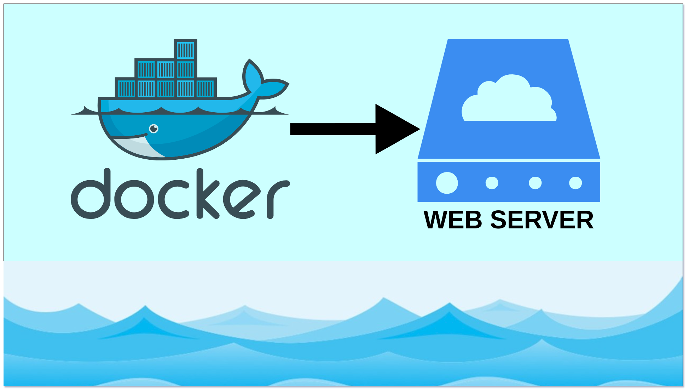

# Building a Web Server using Docker: A Beginner's Guide to DevOps

If you’re a beginner looking to dive into DevOps, one of the best project ideas to start with is building a web server using Docker. This project provides hands-on experience with containers and demonstrates how to use Docker for deploying and managing a web application. Additionally, it offers insights into monitoring your server and troubleshooting issues that may arise. By the end of this project, you'll have a solid understanding of the basics of DevOps concepts.



## Why Docker?

Docker is a platform that allows developers to automate the deployment of applications inside lightweight, portable containers. Containers include everything needed to run the application, such as the code, runtime, libraries, and system tools. This ensures consistency across different environments, making it a valuable tool in DevOps.

## Project Overview

In this project, we will:
1. Install Docker.
2. Create a Dockerfile.
3. Add website content.
4. Build a Docker image.
5. Run a Docker container.
6. Access the web server.
7. Monitor and troubleshoot the server.
8. Clean up resources.

## Step-by-Step Guide

### Step 1: Install Docker

Before you begin, ensure Docker is installed on your machine. Docker provides installation packages for different operating systems, which can be downloaded from [Docker's official website](https://docs.docker.com/engine/install/).

### Step 2: Choose a Web Server

For this project, we will use Nginx, a popular web server known for its performance and ease of use.

### Step 3: Create a Dockerfile

A Dockerfile is a script containing a series of instructions on how to build a Docker image. Here’s how to create one:

1. **Create a Project Directory**: Start by creating a new directory for your project.

``` sh
mkdir my-docker-webserver
cd my-docker-webserver
```
2. **Create the Dockerfile**: Inside this directory, create a file named Dockerfile with the following content:
``` Dockerfile
#Dockerfile

# Use the official Nginx image from Docker Hub
FROM nginx:latest

# Copy the website content to the Nginx container
COPY ./html /usr/share/nginx/html

# Expose port 80
EXPOSE 80
```
### Step 4: Add Your Website Content

Create a directory named `html` in the same directory as your Dockerfile. Inside the `html` directory, create an `index.html` file with some basic HTML content:

``` html
<!DOCTYPE html>
<html lang="en">
<head>
    <meta charset="UTF-8">
    <meta name="viewport" content="width=device-width, initial-scale=1.0">
    <title>My Dockerized Web Server</title>
</head>
<body>
    <h1>Hello, Docker!</h1>
    <p>This is a simple web server running inside a Docker container.</p>
</body>
</html>
```
### Step 5: Build the Docker Image

Open a terminal, navigate to your project directory, and run the following command to build your Docker image:
``` sh
docker build -t my-nginx-webserver .
```
### Step 6: Run the Docker Container

Once the image is built, you can run a container using the following command:
``` sh
docker run -d -p 8080:80 --name my-webserver my-nginx-webserver

```
This command will:

- Run the container in detached mode (-d).
- Map port 8080 on your host to port 80 in the container (-p 8080:80).
- Name the container my-webserver.
- Use the my-nginx-webserver image.

### Step 7: Access Your Web Server

Open a web browser and navigate to **http://localhost:8080**. You should see your simple HTML page displayed.

### Step 8: Monitor and Troubleshoot

To monitor your container, you can use the following Docker commands:

* Check the status of running containers:
``` sh
docker ps
```
* View logs of your web server:
``` sh
docker logs my-webserver
```
* Access the container's shell:
``` sh 
docker exec -it my-webserver /bin/bash
```

### Step 9: Clean Up

To stop and remove the container, run:

``` sh
docker stop my-webserver
docker rm my-webserver
```

To remove the image, run:

``` sh
docker rmi my-nginx-webserver
```

## Conclusion

By completing this project, you gain practical experience with Docker, understand how to containerize applications, and learn basic server monitoring and troubleshooting techniques. This project forms a strong foundation for further exploration into DevOps practices. With Docker, you can deploy and manage applications efficiently, ensuring consistency across different environments. Happy learning!
