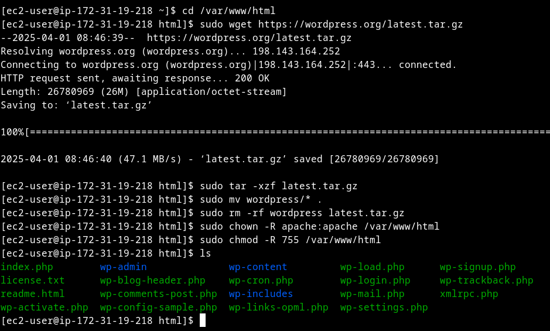
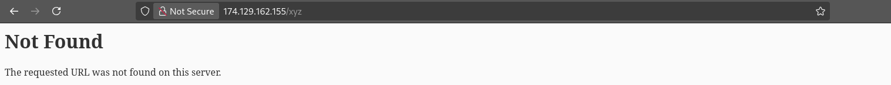

# WordPress Blog on AWS EC2 with RDS

## Overview
This project deploys a WordPress blog on an AWS EC2 instance, using RDS for the MySQL database. It demonstrates compute, database integration, and server management in the cloud.

## What It Does
- Runs a live WordPress site hosted on EC2, with persistent data in RDS.
- Showcases AWS EC2 for compute and RDS for scalable database hosting.

## How I Built It

1. **EC2 Setup**: 
    1. **Log into AWS Console**: Go to EC2, click “Launch Instance.”  
    2. **Choose AMI**: Select “Amazon Linux 2 AMI (HVM)” (free tier eligible).  
    3. **Instance Type**: Pick t2.micro (free tier).  
    4. **Key Pair**: Create a new key pair (e.g., wordpress-key), download the .pem file, and store it securely.  
    5. **Security Group**:  
        - Create a new security group (e.g., wordpress-sg).  
        - Add rules:  
         - SSH (port 22, source: your IP or 0.0.0.0/0).  
         - HTTP (port 80, source: 0.0.0.0/0).
    6. **Launch**: Click “Launch Instance,” note the public IP (e.g.,174.129.162.155/).
    


2. **RDS Configuration**:
    1. **Go to RDS**: In AWS Console, click “Create Database.”  
    2. **Settings**:  
        - Engine: MySQL (free tier: db.t2.micro).  
        - Template: Free Tier.  
        - DB Name: wordpressdb.  
        - Username: admin (or your choice).  
        - Password: Set a strong one (save it!).
    3. **Security Group**: Create a new one (e.g., rds-sg), add a rule:  
        - MySQL/Aurora (port 3306, source: wordpress-sg from EC2).
        
    4. **VPC Settings**: Use the default VPC, ensure “Publicly accessible” is Yes.
        
    5. **Launch**: Create the database, wait ~10 minutes, note the endpoint 
        
        (e.g., wordpressdb.c85wc80g0myi.us-east-1.rds.amazonaws.com).
        

3. **Connect EC2 to RDS**:
    1. **Update EC2 Security Group**:  
        - Edit wordpress-sg, add an outbound rule:  
            - Type: MySQL/Aurora (port 3306), Destination: rds-sg.
        
        

    2. **Test Connection (Optional)**: SSH into EC2 later and ping the RDS endpoint to confirm (I have used telnet (Sudo yum install -y telnet) to check the connection as ping was not working).
        

4. **PHP Upgrade**: Update from PHP 5.4.16 to 8.1 using `amazon-linux-extras` to meet WordPress 6.7.2 requirements.

5. **WordPress Installation**: 
    Install Apache, PHP 8.1, and WordPress on EC2, configured `wp-config.php` with RDS credentials, and resolved database connection issues by ensuring `wordpressdb` exist.
    1. **SSH into EC2**:  
        - On Mac/Linux: 
            ```bash
                ls wordpress-key.pem  #Check for the key .pem file
                chmod 400 wordpress-key.pem  #If pem file is available, change the rwx permissions of the file
                ssh -i "wordpress-key.pem" ec2-user@174.129.162.155  #run the ssh command to connect to your ec2
            ``` 
            

        - On Windows: Use PuTTY (download .ppk key file for windows).

    2. **Update System**:
        ```bash
        sudo yum update -y
        ```
        

    3. **Install Apache, PHP, and Dependencies**: 
        ```bash
        sudo yum install -y httpd php php-mysqlnd
        sudo systemctl start httpd
        sudo systemctl enable httpd
        sudo systemctl status httpd
        ```
        

        

    4. **Download and Set Up WordPress**:
        ```bash
        cd /var/www/html
        sudo wget https://wordpress.org/latest.tar.gz
        sudo tar -xzf latest.tar.gz
        sudo mv wordpress/* .
        sudo rm -rf wordpress latest.tar.gz
        sudo chown -R apache:apache /var/www/html
        sudo chmod -R 755 /var/www/html
        ```
        

    5. **Configure WordPress**
        - Copy the sample config:
            ```bash
            cp wp-config-sample.php wp-config.php
            ```
        - Edit wp-config.php with a text editor (eg., nano):
            ```bash
            sudo nano wp-config.php
            ```
        - Update these lines with your RDS details:
            ```bash
            define('DB_NAME', 'wordpressdb');
            define('DB_USER', 'admin');
            define('DB_PASSWORD', 'your-rds-password');
            define('DB_HOST', 'wordpressdb.abc123.us-east-1.rds.amazonaws.com');
            ```
        - Save (Ctrl+O, Enter, Ctrl+X in nano)

6. **Access and Finalize WordPress**
    1. **Open Browser**: Go to your EC2 public IP (e.g., http://174.129.162.155/).
            
            If you face an error like: 
            *Php version error*: Your server is running PHP version 5.4.16 but WordPress 6.7.2 requires at least 7.2.24 (Update your php version)

            *Database error*: Error establishing a database connection 
            (If your wp-config.php file is correct, Security groups are correct, RDS is available and network works. Try to connect to your database using sql in your ec2 machine and see your databases if you don't see wordpressdb database, create it and you will hopefully be good to go!)
                        
        

    2. **Setup Wizard**: 
        
    Follow WordPress's on-screen prompts:
        - Site title (e.g., “My Cloud Journey”).  
        - Admin username/password (save these!).
        
    3. **Login**: Access http://174.129.162.155/wp-admin/ with your credentials.
        
                 
7. **Test It** 
    - Create a test post (e.g., "Hello from AWS!").
    
    - Visit a nonexistent page (e.g., /xyz) to ensure it loads the WordPress 404.
    

## Tools Used
- AWS EC2 (Free Tier)
- AWS RDS (Free Tier)
- Amazon Linux 2, Apache, PHP, MySQL

## Setup Instructions
- Clone this repo.
- Launch an EC2 instance (t2.micro, Amazon Linux 2) and RDS (MySQL, db.t2.micro) as mentioned above, take help from AWS docs.
- SSH into EC2 and run the install commands from the steps above.
- Configure `wp-config.php` with your RDS details.
- Access the EC2 public IP to set up WordPress.

## Demo
Live at: `http://174.129.162.155/` (Might not be live when you read this article, I am attaching the images of the running website.)


