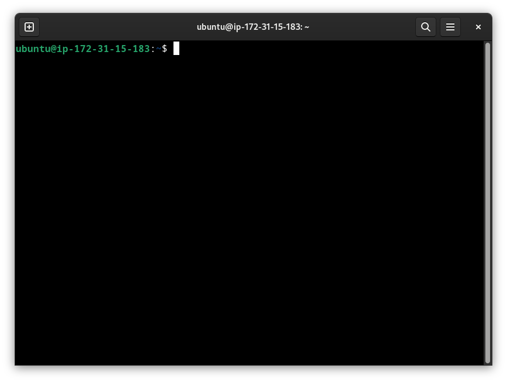
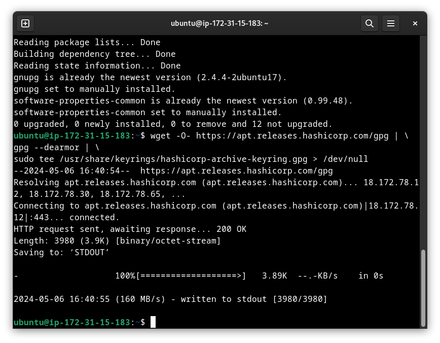
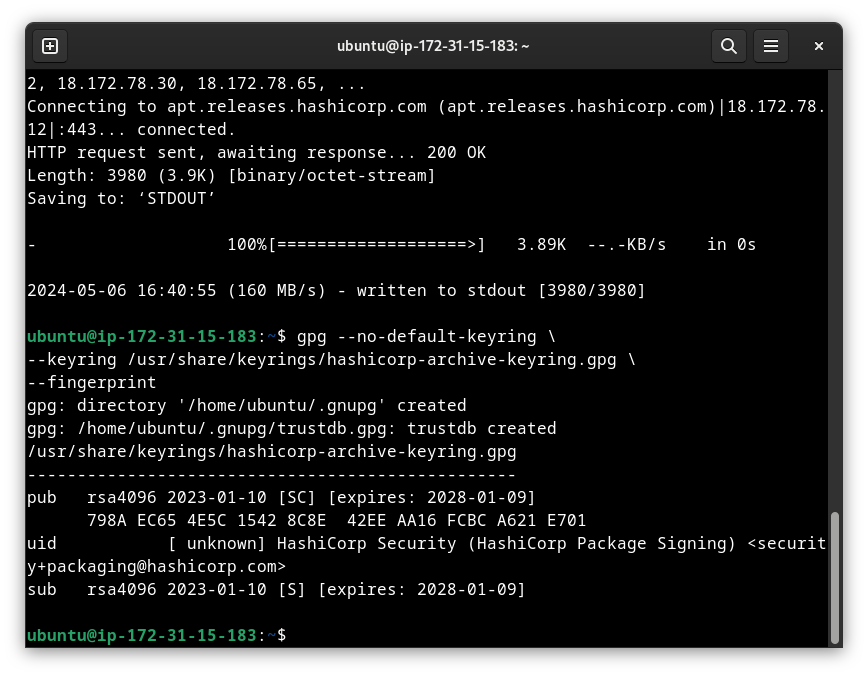
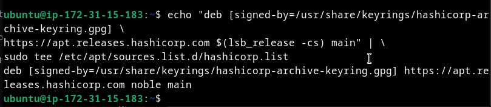
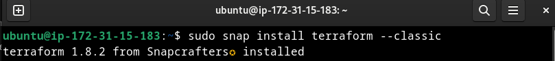
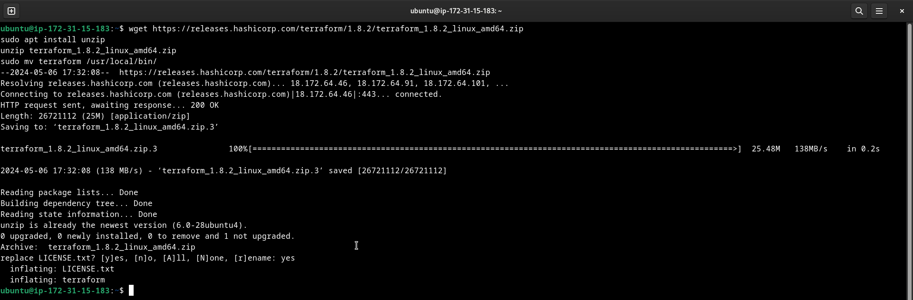
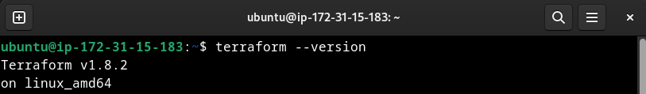
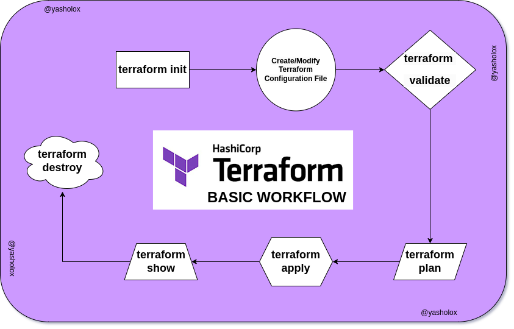

# Terraform
Terraform is an open-source infrastructure as code (Iac) software tool created by HashiCorp. It allows users to define and provision data center infrastructure using a high-level configuration language known as HashiCorp Configuration Language (HCL), or optionally JSON.

With Terraform, you can define the desired state of your infrastructure—like virtual machines, networks, storage, and other resources—using code. Terraform then interprets this code and interacts with APIs of various cloud providers or infrastructure platforms to create, update, or delete the resources needed to match the defined state.

# Benefits of Terraform
- Infrastructure as Code: Define infrastructure in code for versioning, collaboration, and automation.
- Multi-Cloud Support: Manage resources across various cloud providers or on-premises environments.
- Declarative Configuration: Declare desired state; Terraform handles resource creation, updates, and deletions.
- Automation and Consistency: Automate provisioning and ensure consistent infrastructure across environments.
- Scalability: Scale alongside infrastructure needs, managing thousands of resources efficiently.
- Modularity and Reusability: Organize configurations into reusable modules for code reuse and simplicity.
- State Management: Track infrastructure state to detect and manage drifts, ensuring accuracy.
- Manage infrastructure across multiple providers: Making it easier to adopt a multi-cloud strategy or to manage hybrid infrastructure environments. Terraform supports providers such as **Amazon Web Services (AWS), Microsoft Azure, Google Cloud Platform (GCP), VMware, and many others**.

# Terraform Installation and Setup

You can follow the [official article](https://developer.hashicorp.com/terraform/tutorials/aws-get-started/install-cli) on hashicorp website for cli Installation.

I am gonna show you how to do it on ubuntu. Let's see the steps.

1. Open the CLI on your local or cloud ubuntu instance. 


2. Check system updates and install the required packages.
```
sudo apt-get update && sudo apt-get install -y gnupg software-properties-common
```

3. Install the HashiCorp GPG Key. (This GPG key is used for verifying the authenticity and integrity of their software releases.)
```
wget -O- https://apt.releases.hashicorp.com/gpg | \
gpg --dearmor | \
sudo tee /usr/share/keyrings/hashicorp-archive-keyring.gpg > /dev/null
```


4. Let's Verify the key. (This process is crucial for ensuring the authenticity of the key and, by extension, the integrity of the data or software it's associated with.)
```
gpg --no-default-keyring \
--keyring /usr/share/keyrings/hashicorp-archive-keyring.gpg \
--fingerprint
```


5. Add the Hashicorp repository to your system.
```
echo "deb [signed-by=/usr/share/keyrings/hashicorp-archive-keyring.gpg] \
https://apt.releases.hashicorp.com $(lsb_release -cs) main" | \
sudo tee /etc/apt/sources.list.d/hashicorp.list
```


6. Re-update the system to download package information from hashicorp.
```
sudo apt update && sudo apt upgrade
```
7. Finally Install Terraform!

(As of my last update in January 2022, Terraform isn't available in the default Ubuntu repositories managed by APT. So we won't use apt. However, it's possible that the situation has changed since then.)

We will use snap Package Manager.
```
sudo snap install terraform  --classic
```


OR if you don't like snap! 

first remove snap from the system
``` 
sudo apt autoremove --purge snapd 
```
You can try another way: Download from Official Website:
You can download the Terraform binary from the official website and install it manually:

Copy these commands in your terminal to install! (Check latest terraform version [here](https://developer.hashicorp.com/terraform/install) )

```
wget https://releases.hashicorp.com/terraform/1.8.2/terraform_1.8.2_linux_amd64.zip 
sudo apt install unzip
unzip terraform_1.8.2_linux_amd64.zip
sudo mv terraform /usr/local/bin/
```


8. Verify your installation.
```
terraform --version
```


**Terraform is Installed!**

## Some Basic terraform Commands
```
terraform init          Prepare your working directory for other commands
terraform validate      Check whether the configuration is valid
terraform plan          Show changes required by the current configuration
terraform apply         Create or update infrastructure
terraform destroy       Destroy previously-created infrastructure
```

## Workflow:


- Initialize Terraform: Start by running **terraform init** in your project directory. This initializes Terraform and downloads necessary provider plugins.

- Write Terraform Configuration: Create or modify Terraform configuration files (usually with a **.tf extension**) to define the infrastructure you want to manage.

- Validate Configuration: Run **terraform validate** to check the syntax and validity of your configuration files.

- Plan Infrastructure Changes: Run **terraform plan** to generate an execution plan. Review the plan to understand what Terraform will do when you apply the configuration.

- Apply Changes: If the plan looks good, apply the changes by running **terraform apply**. Terraform will create, update, or delete resources as necessary to reach the desired state.

- Manage Infrastructure: Use Terraform commands like terraform show to inspect the current state of your infrastructure and terraform destroy to clean up resources when they're no longer needed.

- Workspace Management (Optional): If you're managing multiple environments, use terraform workspace commands to switch between environments or create new workspaces.

This workflow provides a basic outline of how to use Terraform to manage infrastructure as code. As you gain more experience with Terraform, you'll become familiar with additional commands and more complex workflows for managing infrastructure.